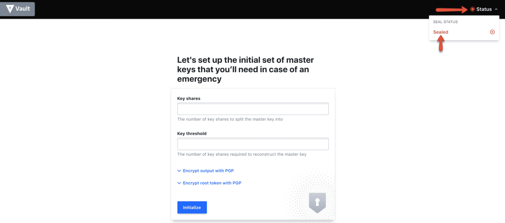
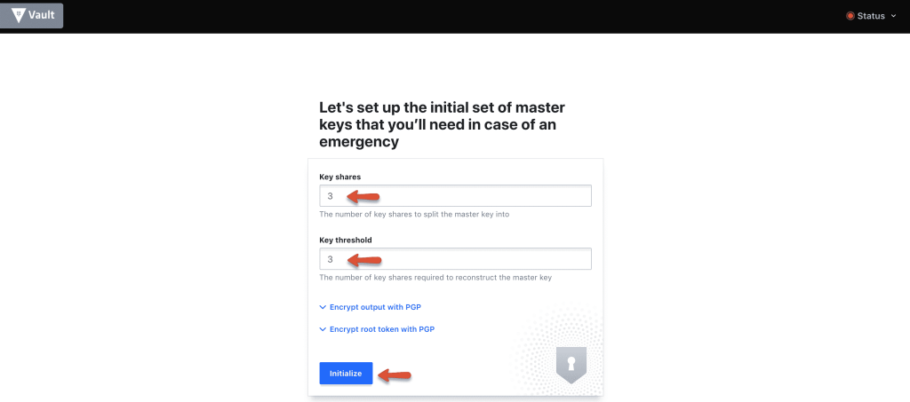
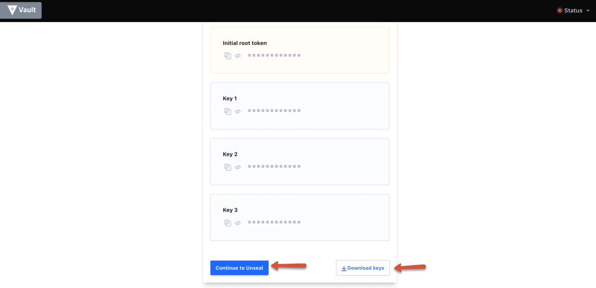
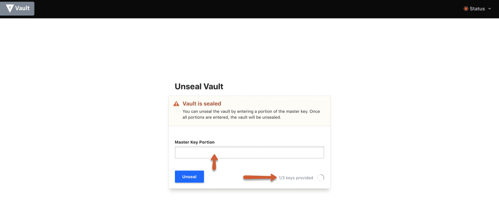
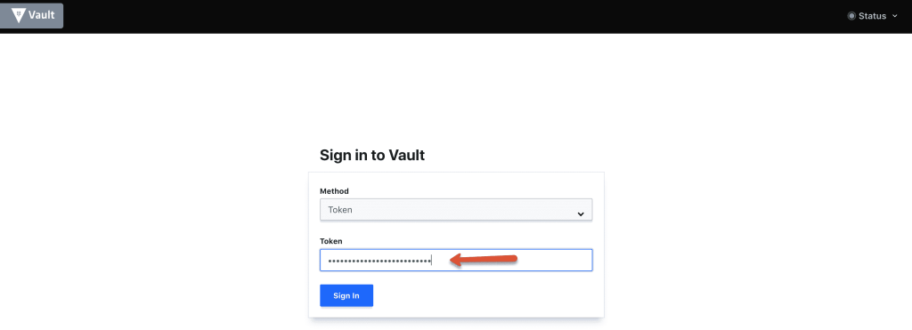
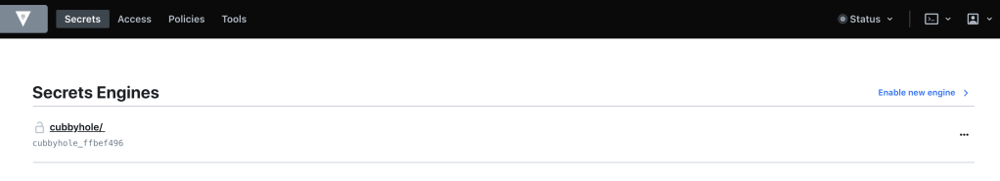

Hashicorp Vault Setup on Amazon Ec2

In this tutorial, you will learn how to set up a Hashicorp vault server
on an Amazon ec2 Linux server for secret management.

Prerequisites:

1.  A Linux ec2 instance.

2.  Access to the ec2 instance over SSH.

3.  In the Security group, port 8200 open to access vault UI, API, and
    SSH access.

**Note: **This tutorial is for single node vault setup with minimal
configuration.

**Step 1:** Head over to the [<u>vault downloads
page</u>](https://releases.hashicorp.com/vault/), and get the latest
vault setup for Linux amd64.

**Step 2:** Download the vault binary to /opt the location.

cd /opt/ && sudo curl -o vault.zip
https://releases.hashicorp.com/vault/1.1.2/vault_1.1.2_linux_amd64.zip

**Step 3:** Unzip the vault executable.

sudo unzip vault.zip

**Step 4:** Move the vault executable to /usr/bin directory.

sudo mv vault /usr/bin/

**Step 5:** Create a user named Vault to run as a service.

sudo useradd --system --home /etc/vault.d --shell /bin/false vault

Configure Vault as a System Service

**Step 1:** Create a vault system service file.

sudo vi /etc/systemd/system/vault.service

**Step 2:** Copy the below configuration to the service file.

*\[Unit\]*

*Description="HashiCorp Vault Service"*

*Requires=network-online.target*

*After=network-online.target*

*ConditionFileNotEmpty=/etc/vault.d/vault.hcl*

*\[Service\]*

*User=vault*

*Group=vault*

*ProtectSystem=full*

*ProtectHome=read-only*

*PrivateTmp=yes*

*PrivateDevices=yes*

*SecureBits=keep-caps*

*AmbientCapabilities=CAP_IPC_LOCK*

*Capabilities=CAP_IPC_LOCK+ep*

*CapabilityBoundingSet=CAP_SYSLOG CAP_IPC_LOCK*

*NoNewPrivileges=yes*

*ExecStart=/usr/bin/vault server -config=/etc/vault.d/vault.hcl*

*ExecReload=/bin/kill --signal HUP \$MAINPID*

*StandardOutput=/logs/vault/output.log*

*StandardError=/logs/vault/error.log*

*KillMode=process*

*KillSignal=SIGINT*

*Restart=on-failure*

*RestartSec=5*

*TimeoutStopSec=30*

*StartLimitIntervalSec=60*

*StartLimitBurst=3*

*LimitNOFILE=65536*

*\[Install\]*

*WantedBy=multi-user.target*

**Step 3:** Create the vault configuration, data & logs directory. Also,
change the ownership of the vault directory to the vault user.

sudo mkdir /etc/vault.d

sudo chown -R vault:vault /etc/vault.d

sudo mkdir /vault-data

sudo chown -R vault:vault /vault-data

sudo mkdir -p /logs/vault/

**Step 4:** Create a vault.hcl file that holds all the vault
configurations.

sudo vi /etc/vault.d/vault.hcl

**Step 5:** Copy the below configuration and save the file.

*listener "tcp" {*

*address = "0.0.0.0:8200"*

*tls_disable = 1*

*}*

*telemetry {*

*statsite_address = "127.0.0.1:8125"*

*disable_hostname = true*

*}*

*storage "file" {*

*path = "/vault-data"*

*}*

*ui = true*

**Step 6:** Enable, start, and check the status of the vault service.

sudo systemctl enable vault

sudo systemctl start vault

sudo systemctl status vault

**Step 7:** Access the vault UI using the public IP /Private IP on port
8200 as shown below.

http://54.218.168.196:8200/ui

When you access the vault UI, by default it will be sealed as shown
below.

**Step 8:** Initialise the vault using the initialise button with 3 key
shares.

**Step 9:** Download the keys using the “Download Keys” button and click
the “Continue to unseal” button.

**Note: **The key files are very important and you should keep them
safe. For any reason, if you restart the server or vault service, the
vault gets locked. You will need these keys to unlock it.

**Step 10:** Enter three keys one by one from the downloaded key file to
unseal vault.

**Step 11:** Once unsealed, log to the vault with the root_token from
the downloaded key file.

Thats it! You will be logging in to the vault server with all default
settings.

